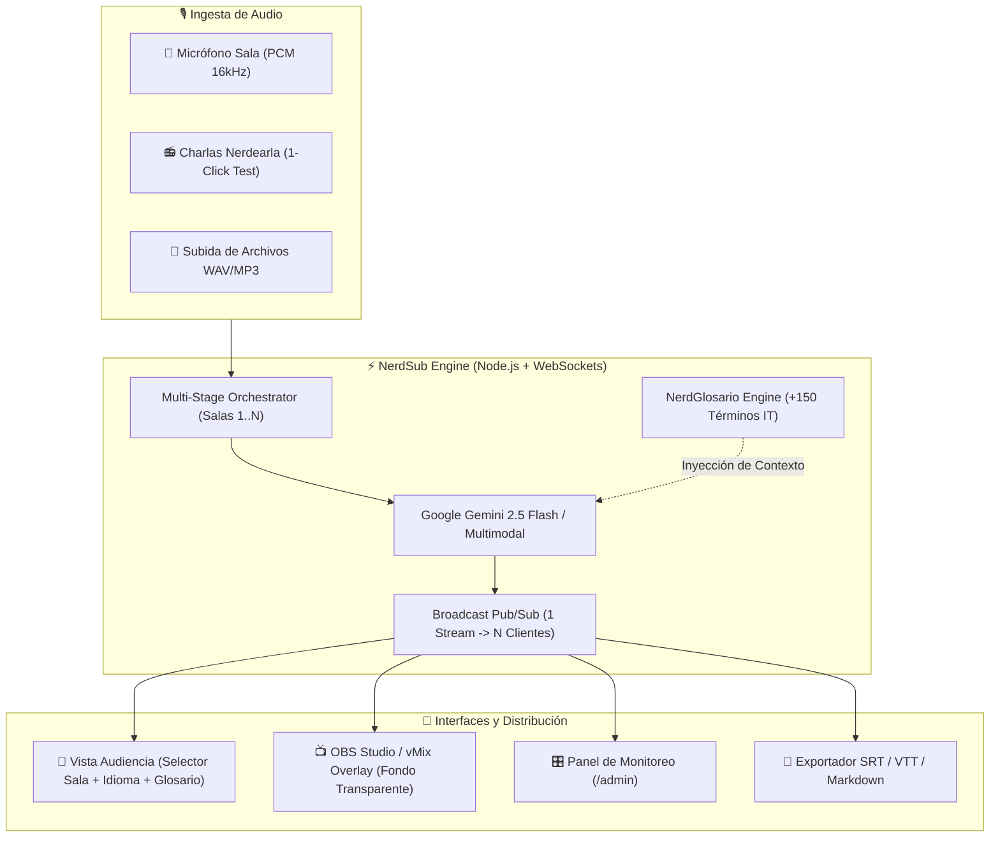

# ⚡ NerdSub

> **Motor Open-Source de Transcripción Simultánea, Traducción Técnica y Accesibilidad a Escala para Conferencias Globales**  
> *Proyecto desarrollado para la Vibeathon de **Nerdearla 2026** (Buenos Aires, Argentina).*

[](./LICENSE)
[](https://nerdear.live)
[](https://aistudio.google.com)
[](https://nodejs.org)
[](https://www.typescriptlang.org)

---

## 📌 1. El Problema que Resolvemos

En eventos masivos como **Nerdearla**, la accesibilidad es prioritaria: más de 30 charlas técnicas con speakers internacionales en inglés y español en simultáneo a lo largo de múltiples auditorios.

Las herramientas comerciales actuales tienen severas limitaciones:
1. **Costos prohibitivos** por minuto y por usuario conectado.
2. **Dependencia de operación manual** propensa a fallas de coordinación.
3. **Pobre calidad con la jerga técnica**: confunden habitualmente términos cruciales como *"deploy"*, *"pod"*, *"eBPF"*, *"commit"*, *"Goroutine"*, *"CI/CD"*, generando transcripciones ininteligibles para la comunidad IT.
4. **Falta de escalabilidad** para correr 5, 10 o más tracks concurrentes de forma autónoma.

**NerdSub** es la solución abierta, modular y de costo ultra-eficiente diseñada para que cualquier conferencia tecnológica en el mundo pueda desplegar subtitulado, traducción simultánea y accesibilidad cognitiva con un solo comando.

---

## ✨ 2. Características Principales

### 🎯 Requisitos Mínimos (MVP) 100% Cumplidos
- **Ingesta de audio versátil**: Micrófono en vivo de sala (Web Audio API / 16kHz PCM), subida de archivos (.mp3, .wav, .webm) y **módulo de prueba en 1 click** con audios de charlas reales de Nerdearla.
- **Transcripción técnica en tiempo real**: Extracción precisa del idioma original (Español o Inglés).
- **Traducción simultánea en vivo**: Inglés ⇄ Español (y Español ⇄ Inglés).
- **Subtítulos interactivos**: Visualizador web reactivo con auto-scroll inteligente y tamaño de fuente regulable.
- **Multi-sesión simultánea nativa**: Procesa múltiples escenarios en paralelo (`Escenario Principal`, `Escenario Cloud & DevOps`, `Escenario Data & AI`) sin interferencias.

### 🍬 Todos los Opcionales Incluidos (Puntos Extra)
- 📺 **OBS / vMix Overlay Mode** (`/overlay`): URL optimizada para *Browser Source* en software de streaming, con fondo 100% transparente y tipografía estilo broadcast con drop shadow y contorno de alto contraste.
- 🌐 **Soporte Multi-idioma Extendido**: Español 🇦🇷, Inglés 🇺🇸 y Portugués 🇧🇷.
- 📖 **NerdGlosario Técnico Inyectado**: Diccionario de +150 términos de DevOps, Cloud, Kubernetes, IA, Rust y Linux inyectados en el system prompt de Gemini para evitar alucinaciones, más un panel para que los organizadores agreguen términos en vivo.
- 💾 **Exportación Post-Charla Multi-formato**: Descarga en 1 click de `.srt` (SubRip), `.vtt` (WebVTT para HTML5), `.md` (Markdown con resumen) y `.txt`.
- 🎛️ **Production Control Room (`/admin`)**: Panel para sonidistas con vúmetro en tiempo real, latencia en milisegundos, medidor de audiencia y control individual de cada sala.

### 🚀 Innovaciones Exclusivas (El Factor Ganador)
- 💡 **NerdGlosario Interactivo para la Audiencia**: Las palabras técnicas difíciles que dice el speaker se iluminan con insignias neón en los subtítulos. Cualquier asistente puede hacer click para ver una tarjeta explicativa instantánea de qué es y para qué sirve (ideal para juniors).
- 🧠 **Live Key Takeaways**: Resumen dinámico en viñetas de las ideas centrales expuestas durante la charla, actualizado en tiempo real.
- ❓ **Smart Q&A Prompts**: Generación automática de preguntas técnicas de alto nivel para el bloque de preguntas y respuestas al finalizar la disertación.

---

## 🏗️ 3. Arquitectura del Sistema



### 💡 Secreto de Escalabilidad y Eficiencia de Costos (1-a-N Pub/Sub)
A diferencia de los servicios comerciales que cobran por cada usuario que mira los subtítulos, **NerdSub realiza únicamente 1 llamada a la API de Gemini por escenario**. Una vez generada la transcripción/traducción, el servidor local de WebSockets la distribuye a cientos o miles de asistentes conectados de forma instantánea:
- **10 escenarios en simultáneo con 5,000 personas en la audiencia** = **10 llamadas de streaming de audio**.
- Costo de infraestructura cercano a cero y consumo de red mínimo.

---

## ⚡ 4. Guía de Inicio Rápido (1 Minuto)

### Prerrequisitos
- Node.js v18 o superior (`node -v`)
- npm (`npm -v`)

### Paso 1: Clonar e Instalar
```bash
git clone https://github.com/tu-usuario/nerdsub.git
cd nerdsub
npm install
```

### Paso 2: Configurar API Key (Opcional para Pruebas)
Copiá el archivo de entorno:
```bash
cp .env.example .env
```
Editá `.env` y colocá tu `GEMINI_API_KEY` (obtenida gratis en [Google AI Studio](https://aistudio.google.com)).  
> *Nota: Si no colocás la clave, NerdSub arranca automáticamente en **Modo Simulación Inteligente**, permitiendo probar todas las funcionalidades y salas concurrentes de inmediato sin bloquearse.*

### Paso 3: Iniciar
```bash
npm start
```
Abrí tu navegador en:
- 📱 **Vista de Audiencia**: [http://localhost:3001](http://localhost:3001)
- 🎛️ **Panel de Producción / Control Room**: [http://localhost:3001](http://localhost:3001) (Click en "Control Room")
- 📺 **OBS Overlay Transparente**: [http://localhost:3001/overlay?stage=stage-1&lang=es](http://localhost:3001/overlay?stage=stage-1&lang=es)

---

## 🎥 5. Guión del Video Demo (1-2 Minutos para el Jurado)

Para grabar el video demo requerido para la entrega en Devpost/YouTube:

1. **0:00 - 0:25 | Introducción**: Presentar el problema en Nerdearla (más de 30 charlas, herramientas comerciales caras y sin precisión en términos técnicos). Mostrar la interfaz de NerdSub con identidad Nerdearla.
2. **0:25 - 0:50 | Calidad y Traducción Técnica en Vivo**:
   - Abrir el **Escenario Principal** (Charla en Inglés sobre Kubernetes y eBPF).
   - Mostrar cómo se traduce al Español preservando perfectamente los términos técnicos (*pods, clusters, eBPF, CI/CD, GitOps*).
   - Hacer click en una píldora de **NerdGlosario** para mostrar la definición instantánea.
3. **0:50 - 1:15 | Escalabilidad Multi-Escenario**:
   - Cambiar en 1 click al **Escenario Cloud & DevOps** (Charla en Español sobre Resiliencia y Caos).
   - Mostrar cómo ambas salas corren en paralelo con métricas de latencia sub-segundo y vúmetros activos.
4. **1:15 - 1:35 | Integración con OBS / Streaming**:
   - Mostrar la pantalla de OBS Overlay (`/overlay`) con fondo transparente y tipografía estilo televisión lista para la transmisión de YouTube/Twitch de Nerdearla.
5. **1:35 - 1:50 | Exportación y Cierre**:
   - Descargar el archivo `.srt` y `.md` con el resumen generado por IA.
   - Destacar la licencia MIT y el impacto para todas las conferencias de la comunidad.

---

## 📈 6. Cómo Escalar a 10+ Escenarios en Producción

NerdSub está diseñado con una arquitectura completamente desacoplada:

1. **Despliegue con Docker / Cloud Run**:
   El proyecto se empaqueta en una imagen liviana de Node.js que consume menos de 150MB de memoria RAM.
2. **Worker Pool para Ingesta de Audio**:
   Para conferencias con más de 20 escenarios en simultáneo, se puede configurar un broker Redis Pub/Sub para desacoplar los procesos de ingesta de audio de los servidores WebSocket de cara al público.
3. **Optimización de Costos**:
   Gracias al modelo **Gemini 2.5 Flash**, el costo por hora de audio procesado es una fracción mínima comparado con los servicios cerrados de transcripción en la nube.

---

## 📄 Licencia

Este proyecto está liberado bajo la **Licencia MIT**, aprobada por la [Open Source Initiative (OSI)](https://opensource.org/licenses/MIT).  
Nerdearla y la comunidad de Sysarmy pueden usar, adaptar, forkear y desplegar esta solución libremente en todas sus ediciones futuras.
