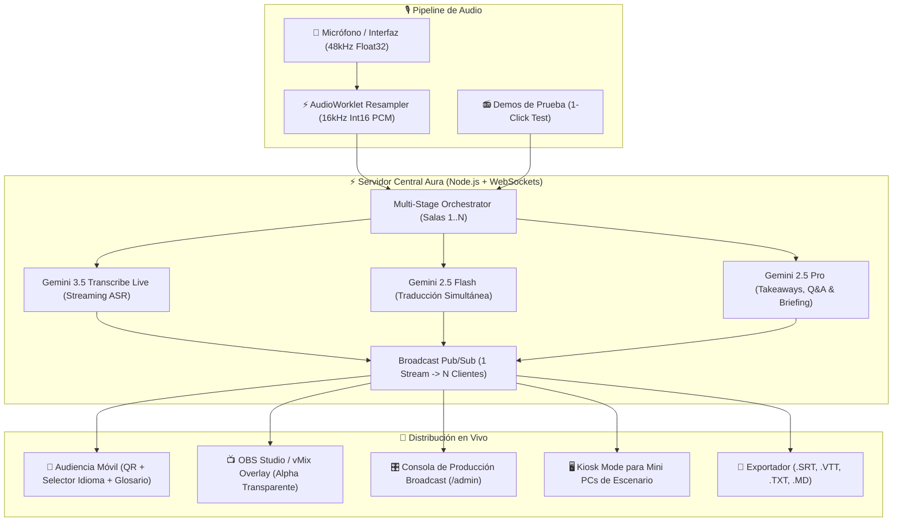

# ⚡ Project Aura

> **Motor Open-Source de Transcripción Simultánea, Traducción Técnica y Accesibilidad a Escala para Conferencias Globales**  
> *Desarrollado por Ezequiel Alfaro para la Vibeathon de **Nerdearla 2026** (Buenos Aires, Argentina) y auditorios de todo el mundo.*

[](./LICENSE)
[](https://nerdear.la)
[](https://blog.google)
[](https://aistudio.google.com)
[](https://aistudio.google.com)
[](https://www.typescriptlang.org)
[](#-arquitectura-del-sistema)

---

## 📌 1. El Problema que Resolvemos

En conferencias técnicas masivas como **Nerdearla**, la accesibilidad es un factor innegociable: más de 30 charlas simultáneas con oradores internacionales en inglés y español distribuidas en múltiples escenarios.

Las soluciones comerciales cerradas fallan estrepitosamente en 4 aspectos críticos:
1. **Costos prohibitivos**: Cobran por minuto y por usuario conectado, haciendo inviable cubrir 5 a 10 salas en simultáneo durante 3 días.
2. **Destrucción de la jerga técnica**: Confunden habitualmente términos cruciales como *"deploy"*, *"eBPF"*, *"Kubernetes"*, *"commit"*, *"Goroutine"*, *"deadlock"*, *"CI/CD"*, generando transcripciones absurdas para una audiencia IT.
3. **Latencia destructiva**: La mayoría de las soluciones acumulan buffers de 6 a 10 segundos antes de procesar, dejando los subtítulos totalmente desfasados del orador.
4. **Falta de integración con transmisiones profesionales**: No ofrecen salidas limpias transparentes para OBS Studio o vMix en transmisiones de Twitch/YouTube.

**Project Aura** es la plataforma abierta, modular y de costo ultra-eficiente diseñada para que cualquier conferencia tecnológica del planeta pueda desplegar subtitulado en tiempo real, traducción simultánea, accesibilidad WCAG AAA y síntesis ejecutiva con un solo comando.

---

## ✨ 2. Características Principales

### 🎙️ Ingesta de Audio de Grado Broadcast (AudioWorklet 16kHz PCM)
- **Remuestreo continuo en hilo de audio dedicado (`public/worklets/pcm-processor.js`)**: Captura audio de micrófono o placa de sonido (44.1kHz / 48kHz) y remuestrea mediante interpolación lineal con memoria residual a **16-bit 16.000 Hz Mono Little-Endian PCM** en bloques de 100ms (3.200 bytes), sin bloquear la interfaz gráfica ni generar chasquidos acústicos.
- **Audio Check Pre-vuelo**: Diagnóstico de entrada con sondeo de decibelios peak/avg y alerta de clipping en tiempo real.
- **Demos integradas en 1 click**: 3 charlas reales pre-cargadas de conferencias para validar el sistema sin necesidad de orador en vivo.

### 🧠 Arquitectura de Doble Motor de Inteligencia Artificial (Google Gemini)
- **Motor en Tiempo Real (Gemini 3.5 Transcribe Live)**: Streaming bidireccional sobre WebSockets con emisión de **sub-150ms speculative interim preview** (texto provisional en vivo con pulsación ámbar) y finalización instantánea con puntuación natural.
- **Motor de Síntesis Ejecutiva (Gemini 2.5 Pro)**: Genera resúmenes ejecutivos en Markdown, lecciones de arquitectura técnica y preguntas agudas sugeridas para el bloque de Q&A post-charla.
- **Fallback Resiliente (Gemini 2.5 Flash + Diccionario Local)**: Si la conexión a la nube sufre micro-cortes, el sistema conmuta sin fisuras a procesamiento local ultrarrápido sin perder una sola palabra.

### 🎛️ Consola de Hardware de Operador (Teenage Engineering & Blackmagic Industrial Design)
- **Rack de 19 pulgadas**: Chasis oscuro anodizado, tornillos hexagonales y tipografía técnica de alto contraste.
- **Vúmetro LED de 12 segmentos**: Indicadores discretos de nivel acústico, decibelios dBFS y advertencia de saturación.
- **Cerrojo de Seguridad de Mesa Técnica**: Bloquea controles sensibles para evitar errores accidentales durante transmisiones en vivo.
- **Auto-Heal Watchdog de 8 Minutos**: Limpia buffers de memoria y renueva la sesión de streaming proactivamente antes de los límites de sesión de Google Live API.
- **Botón de Pánico & Apagón de Emergencia (EDM)**: Borrado instantáneo de la última frase o black-out total de subtítulos ante bloopers o confidencialidad en vivo.
- **Recarga Remota F5**: Recarga nodos de escenario remotos desde la mesa técnica sin requerir software de escritorio remoto (Zero-RustDesk).

### 🌐 Topología Multiescenario Global (Konex & Auditorios del Mundo)
- **Aprovisionamiento Dinámico de Salas**: Modal interactivo para agregar nuevos escenarios en caliente (`+ Agregar Escenario`) especificando track, orador y título.
- **Modo Kiosk para Mini PCs de Escenario**: Interfaz de pantalla completa para Mini PCs ubicadas al pie del escenario con captura de línea y reconexión automática resiliente.
- **Transmisión 1-a-N ultra-escalable**: Un único stream de procesamiento alimenta a miles de espectadores conectados por WebSocket sin costo adicional por asistente.

### 📺 Integración para Transmisiones (OBS Studio / vMix Overlay)
- **Ruta `/overlay` con fondo 100% transparente**: Lista para Browser Source en OBS Studio o vMix con drop-shadow broadcast, división de líneas según estándar CEA-708 y preview en tiempo real del habla del orador.

### ♿ Accesibilidad Radical (WCAG AAA)
- **NerdGlosario Neón Interactivo**: Más de 150 términos técnicos IT inyectados en el system prompt. Los asistentes pueden hacer click en insignias luminosas para leer explicaciones didácticas de términos complejos (ideal para juniors y estudiantes).
- **Tipografía adaptable & Modo Foco**: Regulación de tamaño de fuente (A-, A, A+ Cinema), auto-scroll inteligente con pausa táctil y selector rápido de idioma (Español 🇦🇷, Inglés 🇺🇸, Portugués 🇧🇷).
- **Acceso móvil por Código QR**: Los asistentes escanean el código proyectado y leen la transcripción en sus teléfonos en tiempo real sin instalar apps.

---

## 🏗️ 3. Arquitectura del Sistema



---

## ⚡ 4. Guía de Inicio Rápido

### Prerrequisitos
- Node.js v20 o superior (`node -v`)
- npm (`npm -v`)

### Paso 1: Clonar e Instalar
```bash
git clone https://github.com/EzeAlfaro/ProjectAura.git
cd ProjectAura
npm install
```

### Paso 2: Configurar Credenciales
Copiá el archivo de entorno:
```bash
cp .env.example .env
```
Editá `.env` e ingresá tu clave de API de Google AI Studio:
```env
GEMINI_API_KEY=tu_gemini_api_key_aqui
GEMINI_MODEL=gemini-3.5-transcribe-live
PORT=3001
```
*(Nota: Si no se provee clave, el sistema arranca automáticamente en **Modo Simulación Inteligente**, permitiendo probar la interfaz, los vúmetros y el switching de salas sin conexión exterior).*

### Paso 3: Iniciar
```bash
npm run dev
```

Abrí tu navegador en:
- 📱 **Vista de Audiencia**: [http://localhost:3000](http://localhost:3000)
- 🎛️ **Consola de Operador Broadcast**: [http://localhost:3000](http://localhost:3000) (Click en "Control Room")
- 📺 **Overlay para OBS / vMix**: [http://localhost:3000?view=overlay&stage=stage-1&lang=es](http://localhost:3000?view=overlay&stage=stage-1&lang=es)
- 🖥️ **Modo Kiosk para Mini PC**: [http://localhost:3000?view=kiosk&stage=stage-1](http://localhost:3000?view=kiosk&stage=stage-1)

---

## 📄 Licencia

Este proyecto está publicado bajo la **Licencia MIT**, aprobada por la [Open Source Initiative (OSI)](https://opensource.org/licenses/MIT).  
Nerdearla, Sysarmy y cualquier comunidad tecnológica del mundo tienen plena libertad para utilizar, adaptar, desplegar y enriquecer este motor en sus eventos presentes y futuros.
