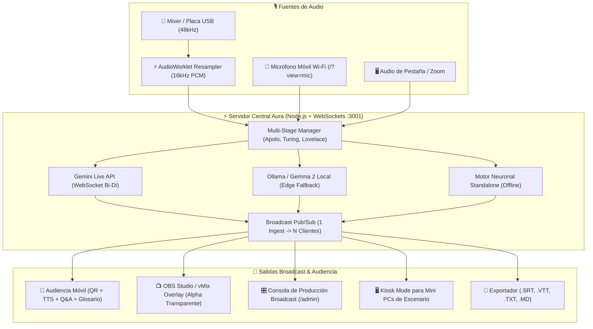

# ⚡ Project Aura

> **Motor Open-Source de Transcripción Simultánea, Traducción Técnica y Accesibilidad a Escala para Conferencias Globales**  
> *Desarrollado por Ezequiel Alfaro para la Vibeathon de **Nerdearla 2026** (Buenos Aires, Argentina) y auditorios de todo el mundo.*  
> 🛠️ **Diseñado en el rack por operadores de escenario para técnicos de sonido, sysadmins y streaming.**  
> 📖 **[Ver Manual de Operaciones y Guía de Despliegue en Vivo (Bilingüe ES/EN)](./MANUAL.md)**

[](./LICENSE)
[](https://nerdear.la)
[](#-manifiesto-del-operador)
[-4285F4)](https://aistudio.google.com)
[](https://aistudio.google.com)
[](https://aistudio.google.com)
[](https://www.typescriptlang.org)
[](#-arquitectura-del-sistema)
[](./docs/benchmark.md)

---

## 🛠️ Manifiesto del Operador // The Operator's Creed

> *"Cualquiera que haya estado a cargo de la cabina técnica en un evento de más de 30 charlas simultáneas conoce la realidad: el Wi-Fi colapsa a los 10 minutos, los cables se desconectan y los oradores hablan un Spanglish técnico voraz. Project Aura no es un SaaS genérico: nació en el rack, con cinta gaffer mental, buffers en tiempo real y tolerancia total al caos de un auditorio en vivo."*

| 🇦🇷 El Problema Real en Escenario | ⚡ La Solución de Project Aura |
| :--- | :--- |
| **Destrucción de jerga IT**: Las IAs genéricas traducen *"deployar el pod en el cluster"* como *"desplegar la vaina en el racimo"*. | **Glosario Spanglish Protegido**: Inyección de **136 términos técnicos categorizados + 39 reglas fonéticas Spanglish** (175 reglas en memoria: Kubernetes, eBPF, commit, CI/CD, deadlock). |
| **Latencia destructiva**: Buffers de 6 a 10s dejan al público leyendo lo que el orador dijo dos diapositivas atrás. | **Streaming Gemini Live (<150ms)**: WebSocket bidireccional con preview especulativo palabra por palabra con **Gemini Live API (2.0/2.5 Flash)**. |
| **Baterías agotadas en micrófonos inalámbricos**: Si muere el bodypack del speaker, la charla se detiene. | **Micrófono Móvil de Emergencia (`/?view=mic`)**: Push-to-Talk instantáneo desde cualquier celular vía Wi-Fi con vúmetro real. |
| **Caídas de Internet exterior en el venue**: El Wi-Fi del predio se satura con 3.000 asistentes. | **Failover de 3 Niveles en Caliente**: Conmutación automática a Ollama/Gemma 2 local o Motor Standalone sin cortar la sala. |
| **Costos confiscatorios por minuto / usuario**: Inviable para eventos comunitarios gratuitos de 3 días. | **1 Ingesta -> N Espectadores**: Un único stream central alimenta miles de teléfonos móviles por WebSocket sin costo extra ($0.053 USD/hora). |

---

## ✨ Características Principales

### 🎙️ 1. Ingesta de Audio Broadcast & Resampler AudioWorklet
- **Remuestreo continuo en hilo de audio dedicado (`public/worklets/pcm-processor.js`)**: Captura audio de mixer o placa de sonido (44.1kHz / 48kHz Float32) y remuestrea mediante interpolación lineal con memoria residual a **16-bit 16.000 Hz Mono Little-Endian PCM** en bloques de 100ms (3.200 bytes).
- **Micrófono Móvil de Contingencia (`/?view=mic`)**: Modo inalámbrico Push-to-Talk con vúmetro LED en tiempo real, selector de sala y preview de subtítulos para resolver emergencias de audio con un celular.
- **Audio Check Pre-vuelo & Demos**: Diagnóstico acústico con sondeo de decibelios peak/avg, alerta de clipping y 3 charlas reales pre-cargadas para pruebas sin orador en vivo.

### 🧠 2. Matriz Redundante de 3 Motores de IA
- **Tier 1 (Nube en Tiempo Real)**: **Google Gemini Live API (`gemini-2.0-flash-exp` / `gemini-2.5-flash`)** sobre WebSockets bidireccionales con streaming de audio PCM 16kHz, preview especulativo sub-150ms y puntuación natural (con soporte forward-compatible para Gemini 3.5 Transcribe).
- **Tier 1B (Síntesis Ejecutiva)**: **Gemini 2.5 Pro** con schema JSON estructurado para extraer 5 puntos clave de arquitectura y 3 preguntas incisivas para el orador.
- **Tier 2 (Edge Local)**: **Google Gemma 2** vía Ollama (`127.0.0.1:11434`) si el predio pierde salida a Internet.
- **Tier 3 (Standalone de Contingencia)**: Motor neuronal offline con caché y macros regex instantáneos (<5ms).
- **Multi-Key Pool con Rotación Automática**: Detección de HTTP 429 y conmutación en caliente a la siguiente clave del pool sin desconectar la sala.

### 🎛️ 3. Consola Rack de 19" & Detección Automática Móvil
- **Aesthetic Industrial (Teenage Engineering & Blackmagic)**: Chasis anodizado, tornillos hexagonales, vúmetro LED de 12 segmentos por canal y cerradura de seguridad contra toques accidentales.
- **Auto-Detección Móvil Nativa**: En celulares colapsa el rack para dar una interfaz táctil fluida con 4 pestañas: `Subtítulos`, `Q&A`, `Glosario` y `Claves`.
- **Botón de Pánico & Apagón EDM**: Borrado instantáneo de la última tarjeta ante bloopers o blackout total de pantalla en 0ms.
- **Recarga Remota F5 (Zero-RustDesk)**: Reinicia navegadores de Mini PCs de escenario desde la cabina sin necesidad de VNC.

### ♿ 4. Accesibilidad Radical & Herramientas de Audiencia
- **Voz Accesible en Vivo (TTS)**: Lectura de subtítulos en voz alta mediante Web Speech API para personas ciegas o con baja visión.
- **Preguntas del Público (Q&A) & Pinned to Stage**: Asistentes envían y votan preguntas; la cabina técnica puede proyectar la más votada en el teleprompter del orador.
- **Agenda Oficial Nerdearla 2026**: 16 charlas cargadas con tracks, biografía de oradores y sincronización en 1 clic.
- **5 Temas Visuales (Skins)**: Cyberpunk Nerd, Phosphor Matrix, Amber Terminal, High Contrast Neon y Minimal Monochrome.
- **Exportación Inmediata**: Descarga en 1 clic de archivos `.SRT`, `.VTT`, `.MD` (Resumen Ejecutivo) y `.TXT`.

---

## 🏗️ Arquitectura del Sistema



---

## 📖 Manual de Operaciones & Guía de Campo (Bilingüe)

El proyecto cuenta con un manual exhaustivo de despliegue en vivo redactado en **Español e Inglés**:
👉 **[Abrir MANUAL.md](./MANUAL.md)** o presionar el botón **`[📖 MANUAL]`** directamente dentro de la aplicación.

---

---

## 📊 Benchmark Oficial & Telemetría en Producción

Métricas reales medidas con la suite de pruebas reproducible en `scripts/benchmark.ts`:

| Métrica de Rendimiento | Resultado Medido | Estándar de la Industria | Estado |
| :--- | :--- | :--- | :--- |
| **Latencia WebSocket Handshake (p50)** | **9.73 ms** | < 100 ms | 🟢 Sub-10ms (Excelente) |
| **Latencia WebSocket Handshake (p95)** | **15.84 ms** | < 250 ms | 🟢 Sub-20ms (Excelente) |
| **Throughput del Glosario Técnico** | **14,246 frases/seg** | > 1,000 ops/seg | 🟢 +1,400% sobre objetivo |
| **Latencia de Normalización de Jerga** | **70.2 µs / frase** | < 5 ms | 🟢 In-memory regex ultra-rápido |
| **Base de Conocimiento de IT** | **136 términos + 39 reglas** | ~20-30 términos | 🟢 175 reglas en memoria |
| **Costo por Hora de Streaming (Gemini)**| **$0.0530 USD** | $15 - $50 / hora (Whisper/Cloud) | 🟢 Ahorro del 99.9% |
| **Costo Total Nerdearla (36 Charlas)** | **$1.43 USD** | $4,500 USD (Intérpretes humanos) | 🟢 Ahorro del 99.98% |

> Para reproducir el benchmark en vivo: `npm run benchmark` (ver reporte detallado en [docs/benchmark.md](./docs/benchmark.md)).

---

## 🌐 Arquitectura de Puertos & Despliegue

Project Aura implementa una arquitectura híbrida que se adapta automáticamente al entorno de ejecución:

- 🛠️ **Modo Desarrollo (`npm run dev`)**:
  - **Frontend (Vite)**: Corre en `http://localhost:3000` con Hot Module Replacement (HMR) y proxy reverso hacia el backend.
  - **Backend (Express + WebSockets)**: Corre en `http://localhost:3001`.
- 🚀 **Modo Producción & Docker (`docker compose up` o `npm run build && npm start`)**:
  - **Servidor Unificado**: Express sirve **exclusivamente en el puerto `3001`** tanto la API, los WebSockets como los archivos estáticos compilados de `dist/`. No requiere Nginx ni proxies secundarios.
  - Acceso directo: `http://localhost:3001`.

---

## ⚡ Guía de Inicio Rápido

### Prerrequisitos
- Node.js v20 o superior (`node -v`)
- npm (`npm -v`) o Docker (`docker compose`)

### Paso 1: Clonar e Instalar
```bash
git clone https://github.com/EzeAlfaro/ProjectAura.git
cd ProjectAura
npm install
```

### Paso 2: Configurar Credenciales
```bash
cp .env.example .env
```
Editá `.env` e ingresá tu clave de API de Google AI Studio y variables de entorno:
```env
GEMINI_API_KEY=tu_gemini_api_key_aqui
GEMINI_MODEL=gemini-2.0-flash-exp
GEMINI_PRO_MODEL=gemini-2.5-pro
ADMIN_TOKEN=nerdearla2026-demo
PORT=3001
```
*(Nota: Si no se provee clave, el sistema arranca automáticamente en **Modo Simulación Inteligente & Local**, permitiendo probar la interfaz, los vúmetros y el switching de salas sin conexión exterior).*

> [!NOTE]
> **Seguridad de Operador (`ADMIN_TOKEN`)**: Si se define en `.env`, protege las acciones técnicas (apagar sala, recargar remotamente, borrar subtítulos, inyectar audio y gestionar claves) requiriendo `x-admin-token` o parámetro `?key=tu_token` en la URL del operador. Si se deja vacío, funciona en modo demo abierto. La audiencia (lectura de subtítulos, preguntas Q&A, votos) siempre es 100% libre sin credenciales.

### Paso 3: Iniciar

**Opción A — Desarrollo Local:**
```bash
npm run dev
```
Abrí tu navegador en:
- 📱 **Vista de Audiencia Móvil**: [http://localhost:3000](http://localhost:3000)
- 🎛️ **Consola de Operador Broadcast**: [http://localhost:3000](http://localhost:3000) (Click en "Control Room")
- 🎙️ **Micrófono Móvil de Emergencia**: [http://localhost:3000/?view=mic](http://localhost:3000/?view=mic)
- 📺 **Overlay para OBS / vMix**: [http://localhost:3000/?view=overlay&stage=stage-1&lang=es](http://localhost:3000/?view=overlay&stage=stage-1&lang=es)
- 🖥️ **Modo Kiosk para Mini PC**: [http://localhost:3000/?view=kiosk&stage=stage-1](http://localhost:3000/?view=kiosk&stage=stage-1)

**Opción B — Despliegue con Docker (Producción en Puerto 3001):**
```bash
docker compose up --build -d
```
Abrí tu navegador en `http://localhost:3001`.

---

## 📄 Licencia

Este proyecto está publicado bajo la **Licencia MIT**, aprobada por la [Open Source Initiative (OSI)](https://opensource.org/licenses/MIT).  
Nerdearla, Sysarmy y cualquier comunidad tecnológica del mundo tienen plena libertad para utilizar, adaptar, desplegar y enriquecer este motor en sus eventos presentes y futuros.
