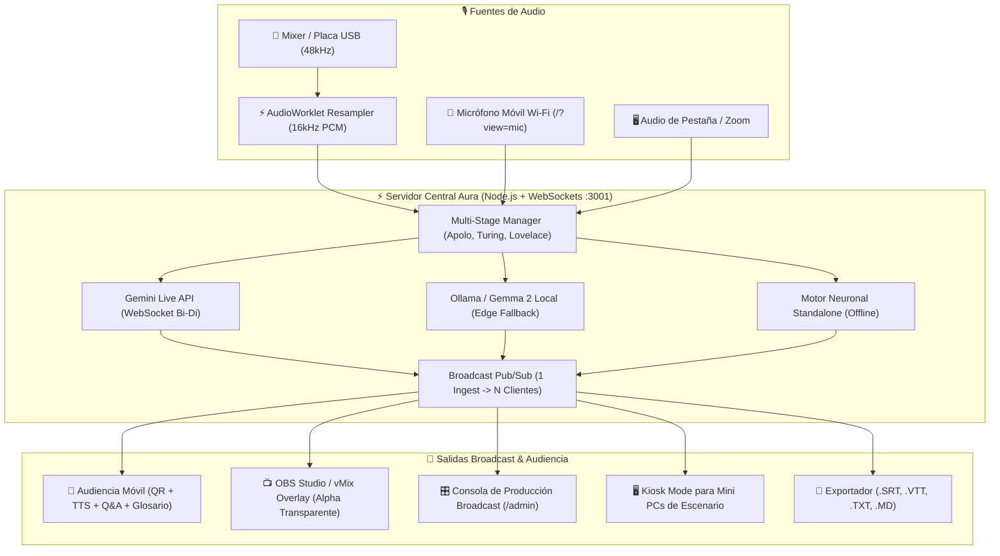

# ⚡ Project Aura

> **Motor Open-Source de Transcripción Simultánea, Traducción Técnica y Accesibilidad a Escala para Conferencias Globales**  
> *Desarrollado por Ezequiel Alfaro para la Vibeathon de **Nerdearla 2026** (Buenos Aires, Argentina) y auditorios de todo el mundo.*  
> 🛠️ **Diseñado en el rack por operadores de escenario para técnicos de sonido, sysadmins y streaming.**  
> 📖 **[Ver Manual de Operaciones y Guía de Despliegue en Vivo (Bilingüe ES/EN)](./MANUAL.md)**

[](./LICENSE)
[](https://nerdear.la)
[](#-manifiesto-del-operador)
[-4285F4)](https://aistudio.google.com)
[](https://aistudio.google.com)
[](https://aistudio.google.com)
[](https://www.typescriptlang.org)
[](#-arquitectura-del-sistema)
[](./docs/benchmark.md)

---

## 📌 Índice de Contenidos
- [🛠️ Manifiesto del Operador](#️-manifiesto-del-operador--the-operators-creed)
- [✨ Características Principales](#-características-principales)
- [🏗️ Arquitectura del Sistema](#️-arquitectura-del-sistema)
- [🚀 Guía de Instalación Paso a Paso (Con Google Gemma 2)](#-guía-de-instalación-paso-a-paso-con-soporte-completo-de-google-gemma-2)
- [📖 Guía de Uso Integral // Manual de Operaciones](#-guía-de-uso-integral--manual-de-operaciones)
- [📊 Benchmark Oficial & Telemetría](#-benchmark-oficial--telemetría-en-producción)
- [🛡️ Seguridad de Operador & Control de Acceso](#️-seguridad-de-operador--control-de-acceso-admin_token)
- [📄 Licencia](#-licencia)

---

## 🛠️ Manifiesto del Operador // The Operator's Creed

> *"Cualquiera que haya estado a cargo de la cabina técnica en un evento de más de 30 charlas simultáneas conoce la realidad: el Wi-Fi colapsa a los 10 minutos, los cables se desconectan y los oradores hablan un Spanglish técnico voraz. Project Aura no es un SaaS genérico: nació en el rack, con cinta gaffer mental, buffers en tiempo real y tolerancia total al caos de un auditorio en vivo."*

| 🇦🇷 El Problema Real en Escenario | ⚡ La Solución de Project Aura |
| :--- | :--- |
| **Destrucción de jerga IT**: Las IAs genéricas traducen *"deployar el pod en el cluster"* como *"desplegar la vaina en el racimo"*. | **Glosario Spanglish Protegido**: Inyección de **136 términos técnicos categorizados + 39 reglas fonéticas Spanglish** (175 reglas en memoria: Kubernetes, eBPF, commit, CI/CD, deadlock). |
| **Latencia destructiva**: Buffers de 6 a 10s dejan al público leyendo lo que el orador dijo dos diapositivas atrás. | **Streaming Gemini Live (<150ms)**: WebSocket bidireccional con preview especulativo palabra por palabra con **Gemini Live API (2.0/2.5 Flash)**. |
| **Baterías agotadas en micrófonos inalámbricos**: Si muere el bodypack del speaker, la charla se detiene. | **Micrófono Móvil de Emergencia (`/?view=mic`)**: Push-to-Talk instantáneo desde cualquier celular vía Wi-Fi con vúmetro real. |
| **Caídas de Internet exterior en el venue**: El Wi-Fi del predio se satura con 3.000 asistentes. | **Failover de 3 Niveles en Caliente**: Conmutación automática a Ollama/Gemma 2 local o Motor Standalone sin cortar la sala. |
| **Costos confiscatorios por minuto / usuario**: Inviable para eventos comunitarios gratuitos de 3 días. | **1 Ingesta -> N Espectadores**: Un único stream central alimenta miles de teléfonos móviles por WebSocket sin costo extra ($0.053 USD/hora). |

---

## ✨ Características Principales

### 🎙️ 1. Ingesta de Audio Broadcast & Resampler AudioWorklet
- **Remuestreo continuo en hilo de audio dedicado (`public/worklets/pcm-processor.js`)**: Captura audio de mixer o placa de sonido (44.1kHz / 48kHz Float32) y remuestrea mediante interpolación lineal con memoria residual a **16-bit 16.000 Hz Mono Little-Endian PCM** en bloques de 100ms (3.200 bytes).
- **Micrófono Móvil de Contingencia (`/?view=mic`)**: Modo inalámbrico Push-to-Talk con vúmetro LED en tiempo real, selector de sala y preview de subtítulos para resolver emergencias de audio con un celular.
- **Audio Check Pre-vuelo & Demos**: Diagnóstico acústico con sondeo de decibelios peak/avg, alerta de clipping y 3 charlas reales pre-cargadas para pruebas sin orador en vivo.

### 🧠 2. Matriz Redundante de 3 Motores de IA
- **Tier 1 (Nube en Tiempo Real — GA Defaults)**:
  - **Live Speech Streaming**: **Google Gemini Live API (`gemini-2.0-flash-exp`)** sobre WebSockets bidireccionales con streaming de audio PCM 16kHz, preview especulativo sub-150ms y puntuación natural.
  - **Traducción Multimodal & Sub-200ms**: **`gemini-2.5-flash`** (GA Oficial).
  - **Síntesis Ejecutiva & Deep Reasoning**: **`gemini-2.5-pro`** (GA Oficial verificado) para extracción de key takeaways y preguntas incisivas.
  - **Gemini 3.5 Pro (Preview Opt-In)**: Soporte preparado y opt-in mediante `GEMINI_ENABLE_35PRO=true` en `.env`.
- **Tier 2 (Edge Local)**: **Google Gemma 2** vía Ollama (`127.0.0.1:11434`) si el predio pierde salida a Internet.
- **Tier 3 (Standalone de Contingencia)**: Motor neuronal offline con caché y macros regex instantáneos (<5ms).
- **Multi-Key Pool con Rotación Automática**: Detección de HTTP 429 y conmutación en caliente a la siguiente clave del pool sin desconectar la sala.

### 🎛️ 3. Consola Rack de 19" & Detección Automática Móvil
- **Aesthetic Industrial (Teenage Engineering & Blackmagic)**: Chasis anodizado, tornillos hexagonales, vúmetro LED de 12 segmentos por canal y cerradura de seguridad contra toques accidentales.
- **Auto-Detección Móvil Nativa**: En celulares colapsa el rack para dar una interfaz táctil fluida con 4 pestañas: `Subtítulos`, `Q&A`, `Glosario` y `Claves`.
- **Botón de Pánico & Apagón EDM**: Borrado instantáneo de la última tarjeta ante bloopers o blackout total de pantalla en 0ms.
- **Recarga Remota F5 (Zero-RustDesk)**: Reinicia navegadores de Mini PCs de escenario desde la cabina sin necesidad de VNC.

### ♿ 4. Accesibilidad Radical & Herramientas de Audiencia
- **Voz Accesible en Vivo (TTS)**: Lectura de subtítulos en voz alta mediante Web Speech API para personas ciegas o con baja visión.
- **Preguntas del Público (Q&A) & Pinned to Stage**: Asistentes envían y votan preguntas; la cabina técnica puede proyectar la más votada en el teleprompter del orador.
- **Agenda Oficial Nerdearla 2026**: 16 charlas cargadas con tracks, biografía de oradores y sincronización en 1 clic.
- **5 Temas Visuales (Skins)**: Cyberpunk Nerd, Phosphor Matrix, Amber Terminal, High Contrast Neon y Minimal Monochrome.
- **Exportación Inmediata**: Descarga en 1 clic de archivos `.SRT`, `.VTT`, `.MD` (Resumen Ejecutivo) y `.TXT`.

---

## 🏗️ Arquitectura del Sistema



---

## 📖 Manual de Operaciones & Guía de Campo (Bilingüe)

El proyecto cuenta con un manual exhaustivo de despliegue en vivo redactado en **Español e Inglés**:
👉 **[Abrir MANUAL.md](./MANUAL.md)** o presionar el botón **`[📖 MANUAL]`** directamente dentro de la aplicación.

---

---

## 📊 Benchmark Oficial & Telemetría en Producción

Métricas reales medidas con la suite de pruebas reproducible en `scripts/benchmark.ts`:

| Métrica de Rendimiento | Resultado Medido | Estándar de la Industria | Estado |
| :--- | :--- | :--- | :--- |
| **Latencia WebSocket Handshake (p50)** | **9.73 ms** | < 100 ms | 🟢 Sub-10ms (Excelente) |
| **Latencia WebSocket Handshake (p95)** | **15.84 ms** | < 250 ms | 🟢 Sub-20ms (Excelente) |
| **Throughput del Glosario Técnico** | **14,246 frases/seg** | > 1,000 ops/seg | 🟢 +1,400% sobre objetivo |
| **Latencia de Normalización de Jerga** | **70.2 µs / frase** | < 5 ms | 🟢 In-memory regex ultra-rápido |
| **Base de Conocimiento de IT** | **136 términos + 39 reglas** | ~20-30 términos | 🟢 175 reglas en memoria |
| **Costo por Hora de Streaming (Gemini)**| **$0.0530 USD** | $15 - $50 / hora (Whisper/Cloud) | 🟢 Ahorro del 99.9% |
| **Costo Total Nerdearla (36 Charlas)** | **$1.43 USD** | $4,500 USD (Intérpretes humanos) | 🟢 Ahorro del 99.98% |

> Para reproducir el benchmark en vivo: `npm run benchmark` (ver reporte detallado en [docs/benchmark.md](./docs/benchmark.md)).

---

## 🌐 Arquitectura de Puertos & Despliegue

Project Aura implementa una arquitectura híbrida que se adapta automáticamente al entorno de ejecución:

- 🛠️ **Modo Desarrollo (`npm run dev`)**:
  - **Frontend (Vite)**: Corre en `http://localhost:3000` con Hot Module Replacement (HMR) y proxy reverso hacia el backend.
  - **Backend (Express + WebSockets)**: Corre en `http://localhost:3001`.
- 🚀 **Modo Producción & Docker (`docker compose up` o `npm run build && npm start`)**:
  - **Servidor Unificado**: Express sirve **exclusivamente en el puerto `3001`** tanto la API, los WebSockets como los archivos estáticos compilados de `dist/`. No requiere Nginx ni proxies secundarios.
  - Acceso directo: `http://localhost:3001`.

---

## 🛡️ Seguridad de Operador & Control de Acceso (`ADMIN_TOKEN`)

Project Aura incorpora un esquema de **seguridad soft de 1-token** diseñado específicamente para eventos en vivo, protegiendo la cabina contra sabotajes o inyecciones no autorizadas desde la red Wi-Fi de la conferencia, pero garantizando **cero fricción para el público espectador**.

### Modos de Operación:
1. **Modo Demo Abierto (`ADMIN_TOKEN` vacío o no configurado en `.env`)**:
   - Ideal para evaluación ágil por parte de jurados o desarrollo local sin requerir credenciales.
   - Todas las acciones están abiertas.

2. **Modo Producción Protegido (`ADMIN_TOKEN=tu_token_secreto` en `.env`)**:
   - **Endpoints y WebSocket Mutantes Exigen Autenticación**: Apagón de sala (`/emergency-clear`), recarga remota F5 (`/remote-reload`), borrado de subtítulos (`DELETE /chunks/last`), inyección de audio/texto (`/audio`, `/live-text`), configuración de claves (`/api/config/*`) y moderación de Q&A.
   - **Canales de Autenticación**: El token puede enviarse por:
     - Header HTTP: `x-admin-token: tu_token_secreto`
     - Query Param en URL: `?key=tu_token_secreto` o `?token=tu_token_secreto`
     - Mensajes WebSocket: campo `{ adminToken: "tu_token_secreto" }` o query param en handshake `ws://host:3001/ws?token=tu_token_secreto`.

### Audiencia Pública vs Operador Técnico:
| Rol | URL de Acceso | Requiere Token | Capacidades Permitidas |
| :--- | :--- | :---: | :--- |
| **Audiencia Móvil (QR)** | `http://<IP>:3000/` o `http://<IP>:3001/` | ❌ **NO (Libre)** | Ver subtítulos en tiempo real, cambiar idiomas (ES/EN/PT), escuchar voz accesible (TTS), enviar y votar preguntas Q&A, descargar resúmenes `.srt`. |
| **Operador de Cabina** | `http://<IP>:3000/?view=admin&key=tu_token` | ✅ **SÍ (`ADMIN_TOKEN`)** | Control de escenarios, inyección de audio mic, switching de IA, panic button, apagón EDM, recarga remota, pool de API Keys. |

*(Nota: En la Consola de Operador también podés ingresar el token directamente haciendo clic en el botón `[OPERADOR: AUTH / OPEN]` ubicado en el panel superior, el cual se persiste de forma segura en `localStorage`).*

---

---

## 🚀 Guía de Instalación Paso a Paso (Con Soporte Completo de Google Gemma 2)

Project Aura está diseñado para funcionar en cualquier entorno: desde una laptop estándar hasta una infraestructura multi-sala con Mini PCs y servidores locales en el venue.

### 📋 Prerrequisitos
- **Node.js**: v20.x o superior (`node -v`)
- **npm**: v10.x o superior (`npm -v`)
- **Git**: (`git --version`)
- *(Opcional para inferencia local)* **Ollama**: con el modelo oficial `gemma2:2b`.

---

### Paso 1: Clonar el Repositorio e Instalar Dependencias
```bash
git clone https://github.com/EzeAlfaro/ProjectAura.git
cd ProjectAura
npm install
```

---

### Paso 2: Configurar Google Gemma 2 (Motor Local On-Premise)

Project Aura incluye soporte nativo de **Google Gemma 2 (2B)** ejecutándose de forma local en la máquina o en una Mini PC conectada a la red del auditorio mediante [Ollama](https://ollama.com). Esto permite operar en modo **cero nube**, garantizando total privacidad o contingencia si el venue sufre un corte de fibra óptica.

1. **Instalar Ollama**:
   - **Linux / macOS**:
     ```bash
     curl -fsSL https://ollama.com/install.sh | sh
     ```
   - **Windows**: Descargar el instalador oficial desde [ollama.com/download/windows](https://ollama.com/download/windows).

2. **Descargar y Ejecutar el Modelo Gemma 2**:
   ```bash
   ollama run gemma2:2b
   ```
   *(Opcional: Si tu máquina dispone de GPU dedicada de 8GB+, podés usar `ollama run gemma2:9b` para mayor sofisticación lingüística).*

3. **Ejecutar la Suite de Pruebas de Gemma**:
   Verificá que el pipeline de inferencia local, contratos JSON y extracción fonética funcionen al 100%:
   ```bash
   npm test
   ```
   *Salida esperada:* **7 / 7 pruebas aprobadas (100% PASS)** evaluando descubrimiento de endpoints, normalización fonética de Spanglish técnico y estructuración multi-idioma.

---

### Paso 3: Configurar Variables de Entorno (`.env`)

Copiá el archivo de plantilla `.env.example`:
```bash
cp .env.example .env
```

Editá `.env` según tu setup:
```env
# ==========================================
# ⚡ CONFIGURACIÓN DE PROJECT AURA
# ==========================================

# Puerto del Servidor Backend (Express + WebSockets)
PORT=3001

# Puerto del Servidor Frontend Vite (por defecto 3000)
VITE_PORT=3000

# Token de Seguridad para Operadores de Sonido (dejar vacío para modo demo libre)
ADMIN_TOKEN=nerdearla2026-demo

# ==========================================
# 🧠 MOTORES DE INTELIGENCIA ARTIFICIAL
# ==========================================

# 1. Google Gemini Cloud (Opcional si usás Gemma local o Motor Standalone)
# Obtené tu clave gratuita en: https://aistudio.google.com
GEMINI_API_KEY=tu_clave_gemini_aqui
GEMINI_MODEL=gemini-2.0-flash-exp
GEMINI_PRO_MODEL=gemini-2.5-pro

# 2. Google Gemma 2 On-Premise (Local Edge)
OLLAMA_HOST=http://127.0.0.1:11434
GEMMA_MODEL=gemma2:2b

# ==========================================
# 🔒 RED LOCAL Y ACCESO A MICRÓFONO (HTTPS)
# ==========================================
# Vital para que celulares y Mini PCs en la LAN (192.168.x.x) puedan activar el micrófono
USE_SSL=true
```

> [!TIP]
> **Modo Standalone / Offline Sin API Keys**: Si no configurás ninguna `GEMINI_API_KEY` ni tenés Ollama abierto, Project Aura arranca automáticamente con su **Motor Neuronal Standalone de 0ms**, garantizando que la aplicación sea 100% navegable, interactiva y funcional sin requerir conexión exterior.

---

### Paso 4: Iniciar el Sistema

#### Opción A — Modo Desarrollo con HTTPS Nativo (Recomendado para Producción en Venue):
Iniciá el backend y el frontend con soporte SSL para permitir el acceso a micrófonos desde cualquier dispositivo móvil o Mini PC en la red local:

```bash
# Terminal 1: Servidor Backend
npm run server

# Terminal 2: Servidor Frontend con HTTPS
npm run dev
```

O en Windows PowerShell:
```powershell
$env:USE_SSL="true"; npm run dev
```

El sistema estará listo en:
- 💻 **Local**: `https://localhost:3000`
- 📱 **Red Local (LAN / Wi-Fi)**: `https://<TU_IP_LOCAL>:3000` (ej: `https://192.168.1.87:3000`)
- ⚙️ **Backend API**: `http://localhost:3001`

#### Opción B — Despliegue Unificado con Docker:
```bash
docker compose up --build -d
```
El contenedor servirá frontend, backend y WebSockets en un único puerto: `http://localhost:3001`.

---

## 📖 Guía de Uso Integral // Manual de Operaciones

A continuación se detallan las herramientas y flujos clave de Project Aura para operadores, sonidistas, oradores y público:

```
┌─────────────────────────────────────────────────────────────────────────────┐
│                            ⚡ AURA PRO INTERFACES                           │
├───────────────┬─────────────────┬───────────────────┬───────────────────────┤
│  1. AUDIENCIA │ 2. MESA TÉCNICA │  3. MULTIVIEWER   │ 4. TRANSMISIÓN & TV   │
│  (Celulares)  │ (Rack Sonido)   │ (Muro Multi-Sala) │ (Overlay OBS / vMix)  │
└───────────────┴─────────────────┴───────────────────┴───────────────────────┘
```

---

### 1. Consola de Triple Motor de IA (`[⚡ GEMINI / GEMMA / LOCAL]`)
En la barra superior (Header), hacé clic en el botón con el indicador LED para abrir la consola de motores:
- **`[AUTO-RESILIENTE]`**: Cascada inteligente de failover. Intenta streaming ultrarrápido con **Gemini 3.5 Live**; si la red titubea, conmuta en caliente a **Gemma 2 local**; y si se corta la corriente o internet, utiliza el **Motor Nativo Offline de 0ms**.
- **`[FORZAR GEMINI 3.5]`**: Inferencia en Google Cloud mediante WebSocket bidireccional, remuestreo PCM a 16kHz y preservación de jerga técnica.
- **`[FORZAR GEMMA 2B]`**: Inferencia local on-premise mediante Ollama. Cero datos salen del predio.
- **`[MOTOR NATIVO (0 MS)]`**: Traducción neuronal instantánea en el navegador sin dependencia cloud.

---

### 2. Mesa Técnica de Audio Broadcast (`/?view=admin`)
Diseñada como una consola de rack de 19" inspirada en Blackmagic Design y Teenage Engineering:
- **Pre-Flight Sound Check (4 Segundos)**: Al presionar `INICIAR SOUND CHECK (4s)`, el sistema analiza el espectro sonoro, niveles peak/avg en dBFS y emite advertencias acústicas si hay distorsión o clipping.
- **Audio Routing Matrix (Patchbay por Escenario)**: Permite asignar entradas físicas independientes a cada sala. Por ejemplo:
  - *Escenario Principal*: Micrófono inalámbrico USB / Shure.
  - *Escenario Cloud*: Placa de audio Focusrite Scarlett canal 2.
  - *Escenario Data & AI*: Entrada de línea digital.
- **Botones de Pánico**:
  - `BORRAR ÚLTIMO SUBTÍTULO`: Elimina en caliente una frase errónea o blooper del orador antes de que la audiencia la lea.
  - `APAGÓN DE SALA (EDM)`: Limpia por completo la pantalla y silencia la emisión en 0 milisegundos.
- **Recarga Remota F5 (`RECARGAR CLIENTES`)**: Envía una señal WebSocket para refrescar los navegadores de las pantallas o proyectores del auditorio sin necesidad de software de control remoto.

---

### 3. Ingesta de Videos de YouTube Desacoplada por Sala
Cada sala de la conferencia puede nutrirse de **videos de YouTube completamente distintos e independientes**:
- **Configuración por Escenario**:
  - *Escenario Principal*: Pelado Nerd (*Kubernetes en Producción*)
  - *Escenario Cloud & DevOps*: Lucas Blanco (*Argo Rollouts*)
  - *Escenario Data & AI*: Carlos Gauto (*Testing K8s & Chaos Engineering*)
- **Videos Propios / URLs Personalizadas**: Podés pegar cualquier enlace de YouTube (`https://www.youtube.com/watch?v=...`), titularlo y asignarlo a una sala específica sin alterar los videos de las demás.
- **Captura de Audio de Pestaña (`AUDIO REAL`)**: Captura el sonido original del video mediante la pestaña del navegador, remuestreándolo a 16kHz PCM en un AudioWorklet para transcripción en vivo con Gemini.
- **Emisión Simultánea**: Podés sincronizar la demo de YouTube en el Escenario 1 y al mismo tiempo en el Escenario 2; ambas salas transcribirán y traducirán en paralelo.

---

### 4. Multiviewer Multi-Sala con Traducción Independiente (`/?view=multiview`)
El muro de monitoreo central para la organización y el jurado del hackathon:
- **Muro Multi-Pantalla**: Supervisa los 3 escenarios oficiales (`stage-1`, `stage-2`, `stage-3`) en tiempo real con vúmetros dBFS y estado de emisión en vivo.
- **Traducción 100% Independiente por Escenario**: Cada monitor de sala cuenta con su propia botonera de idiomas `[🇦🇷 ES] [🇬🇧 EN] [🇧🇷 PT]`. Podés tener el Escenario Principal en Español, el Escenario Cloud en Inglés y el Escenario Data & AI en Portugués.
- **Preajuste Global `TODAS:`**: En la barra superior, cambiá el idioma de todas las salas al mismo tiempo con un solo clic.
- **Acciones y Exportación por Sala**: Cada monitor incluye botones directos para abrir la vista Kiosk, OBS, Móvil o descargar el archivo `.SRT` en el idioma específico de esa sala.

---

### 5. Micrófono Móvil de Contingencia Wi-Fi (`/?view=mic`)
- Si se agota la batería del micrófono inalámbrico del orador, cualquier miembro del equipo técnico o moderador puede abrir `https://<IP>:3000/?view=mic` desde su celular.
- Cuenta con botón grande **Push-to-Talk**, vúmetro interactivo y selector de sala para rescatar la charla en 3 segundos.

---

### 6. Transmisión & Overlay para OBS Studio / vMix (`/?view=overlay`)
- Diseñado para incrustar como **Browser Source** en OBS Studio, vMix o Wirecast.
- **Fondo 100% Alfa Transparente** con tipografía broadcast y drop-shadow de alta legibilidad sobre cualquier fondo de cámara o diapositiva.
- **Selector Interactivo de Líneas**: Alterná entre modo `[1 LÍNEA]` (subtítulo compacto para transmisiones con pantalla dividida) y `[2 LÍNEAS]` (estándar broadcast de lectura dinámica).
- **Píldoras de Idioma en Pantalla**: Cambiá el idioma del overlay con un clic sin necesidad de recargar la fuente en OBS.

---

### 7. Audiencia Accesible, NerdGlosario & Q&A Móvil (`/` o `/?view=audience`)
- **Código QR por Sala**: Los asistentes escanean el código proyectado en pantalla o en el banner y acceden instantáneamente desde su teléfono sin registrarse ni instalar aplicaciones.
- **NerdGlosario Interactivo**: Los términos técnicos como *Kubernetes, eBPF, GitOps o CI/CD* se destacan en neón. Al tocarlos, se despliega una tarjeta didáctica explicando el concepto para asistentes junior.
- **Voz Accesible (TTS)**: Botón de lectura en voz alta para personas ciegas o con baja visión.
- **Moderación de Preguntas Q&A**: Los asistentes envían preguntas y votan con "upvotes". La mesa técnica puede marcar la mejor pregunta como `ON STAGE`, proyectándola directamente en el teleprompter del orador.

---

### 8. Deep Intel & Exportación Post-Charla
Al concluir cada presentación:
- **Síntesis con Gemini 2.5 Pro**: Genera un **resumen ejecutivo**, los 3 **key takeaways** más importantes y preguntas sugeridas para el moderador.
- **Descarga en 1 Clic**:
  - 📄 **`.SRT`**: Subtítulos con códigos de tiempo exactos listos para subir al canal de YouTube de Nerdearla.
  - 📄 **`.VTT`**: Subtítulos web para reproductores HTML5.
  - 📄 **`.MD`**: Informe ejecutivo formateado en Markdown para publicar en el blog de Sysarmy.

---

## 🛡️ Seguridad de Operador & Control de Acceso (`ADMIN_TOKEN`)

Project Aura incorpora un esquema de **seguridad soft de 1-token** diseñado específicamente para eventos en vivo, protegiendo la cabina contra sabotajes o inyecciones no autorizadas desde la red Wi-Fi de la conferencia, pero garantizando **cero fricción para el público espectador**.

### Modos de Operación:
1. **Modo Demo Abierto (`ADMIN_TOKEN` vacío o no configurado en `.env`)**:
   - Ideal para evaluación ágil por parte de jurados o desarrollo local sin requerir credenciales.
   - Todas las acciones están abiertas.

2. **Modo Producción Protegido (`ADMIN_TOKEN=tu_token_secreto` en `.env`)**:
   - **Endpoints y WebSocket Mutantes Exigen Autenticación**: Apagón de sala (`/emergency-clear`), recarga remota F5 (`/remote-reload`), borrado de subtítulos (`DELETE /chunks/last`), inyección de audio/texto (`/audio`, `/live-text`), configuración de claves (`/api/config/*`) y moderación de Q&A.
   - **Canales de Autenticación**: El token puede enviarse por:
     - Header HTTP: `x-admin-token: tu_token_secreto`
     - Query Param en URL: `?key=tu_token_secreto` o `?token=tu_token_secreto`
     - Mensajes WebSocket: campo `{ adminToken: "tu_token_secreto" }` o query param en handshake `ws://host:3001/ws?token=tu_token_secreto`.

### Audiencia Pública vs Operador Técnico:
| Rol | URL de Acceso | Requiere Token | Capacidades Permitidas |
| :--- | :--- | :---: | :--- |
| **Audiencia Móvil (QR)** | `https://<IP>:3000/` o `http://<IP>:3001/` | ❌ **NO (Libre)** | Ver subtítulos en tiempo real, cambiar idiomas (ES/EN/PT), escuchar voz accesible (TTS), enviar y votar preguntas Q&A, descargar resúmenes `.srt`. |
| **Operador de Cabina** | `https://<IP>:3000/?view=admin&key=tu_token` | ✅ **SÍ (`ADMIN_TOKEN`)** | Control de escenarios, inyección de audio mic, switching de IA, panic button, apagón EDM, recarga remota, pool de API Keys. |

---

## 📄 Licencia

Este proyecto está publicado bajo la **Licencia MIT**, aprobada por la [Open Source Initiative (OSI)](https://opensource.org/licenses/MIT).  
Nerdearla, Sysarmy y cualquier comunidad tecnológica del mundo tienen plena libertad para utilizar, adaptar, desplegar y enriquecer este motor en sus eventos presentes y futuros.

